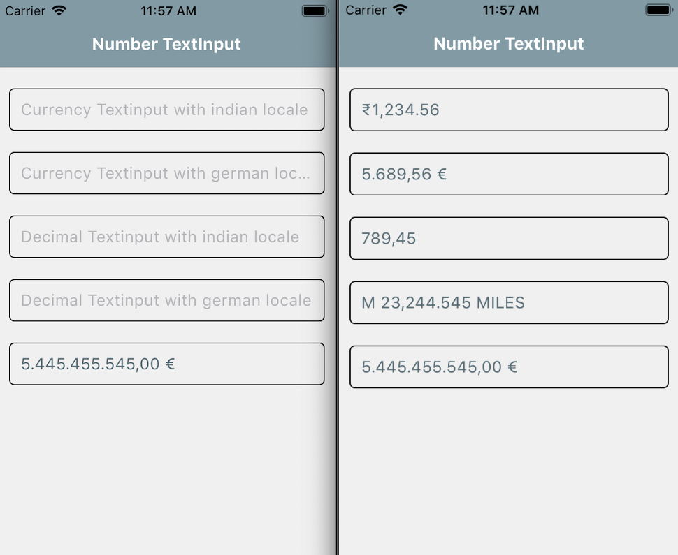

# React Native - Number Input

A React Native based component for creating Number Input in your application.

## Table of Contents 

- [Demo](#demo)
- [Installation](#installation)
- [Caveats](#caveats)
- [Supported versions](#supported-versions)
- [Usage](#usage)
- [Examples](#examples)
- [Props](#props)
- [Methods](#methods)
- [Want to Contribute?](#want-to-contribute?)
- [Collection of Components](#collection-of-components)
- [Changelog](#changelog)
- [License](#license)
- [Keywords](#keywords)

## Demo

[](https://github.com/weblineindia/React-Native-Number-Input/blob/master/Numeric.png)

## Installation

`$ npm install rn-weblineindia-number-input --save`

## Caveats

Android currently does not implement the Intl object so a polyfill is required. At the moment it only includes the en locale.

## Supported versions

We have tested this component in ReactNative 0.60 - 0.62.5. You can still use it in other versions.

## Usage

To use it, register Number-Input Component to the navigation stack

```javascript
import NumberTextInput from 'rn-weblineindia-number-input';

 <NumberTextInput
  type='currency'
  locale='en-IN'
  currency='INR'
  decimalPlaces={2}
  value={this.state.textInput1}
  onUpdate={(value) => this.setState({ textInput1: value })}
  style={styles.textInputStyle}
  returnKeyType={'done'}
  allowNegative={true}
 />
```

## Examples

Currency

```javascript
<NumberTextInput
  type='currency'
  locale='en-IN'
  currency='INR'
  decimalPlaces={2}
  value={this.state.textInput1}
  onUpdate={(value) => this.setState({ textInput1: value })}
  style={styles.textInputStyle}
  returnKeyType={'done'}
 />
```

Decimal

```javascript
<NumberTextInput
 type='decimal'
 decimalPlaces={2}
 value={this.state.textInput2}
 onUpdate={(value) => this.setState({ textInput2: value })}
 style={styles.textInputStyle}
 returnKeyType={'done'}
/>
```

## Props

| **Props**       | **Type** | **Required** | **Description**                                                                                                                      |
|-----------------|----------|--------------|--------------------------------------------------------------------------------------------------------------------------------------|
| value           | `Number` | Yes          | If not provided, will default to 0                                                                                                   |
| type            | `string` | no           | Either decimal or currency. If not provided, will default to decimal. If type is currency,you'll also need to supply a currency prop.|
| decimalPlaces   | `Number` | no           | Number - the number of decimal places to display. Only valid for decimal type.                                                       |
| placeholderImage| `string` | no           | To show default image when image has issue.Required local image path.                                                                |
| currency        | `string` | no           | The ISO 4217 currency code of the currency to display. Defaults to EUR.                                                              |
| locale          | `string` | no           | A BCP 78 language tag specifying the locale used for number formatting. Defaults to de-DE                                            |
| useGrouping     | `Boolean`| no           | Whether to use grouping separators. Defaults to true.                                                                                |
| returnKeyType   | `string` | no           | Default is Done                                                                                                                      |
| prefix          | `string` | no           | Add a prefix before the number                                                                                                       |
| postfix         | `string` | no           | Add a prefix after the number                                                                                                        |
| allowNegative   | `Boolean`| no           | Allowed negative sign. default is false                                                                                              |


## Methods

| **Method**           | **Description**                                                             |
|----------------------|-----------------------------------------------------------------------------|
| onUpdate             | Callback that is called when the text input's content size changes.         |


## Want to Contribute?

- Created something awesome, made this code better, added some functionality, or whatever (this is the hardest part).
- [Fork it](http://help.github.com/forking/).
- Create new branch to contribute your changes.
- Commit all your changes to your branch.
- Submit a [pull request](http://help.github.com/pull-requests/).

-----

## Collection of Components

We have built many other components and free resources for software development in various programming languages. Kindly click here to view our [Free Resources for Software Development](https://www.weblineindia.com/software-development-resources.html).

------

## Changelog

Detailed changes for each release are documented in [CHANGELOG.md](./CHANGELOG.md).

------

## License

[MIT](LICENSE)

[mit]: https://github.com/weblineindia/React-Native-Number-Input/blob/master/LICENSE

------

### Keywords

 rn-weblineindia-number-input, react-native-number-input, number-input, numeric-input, reactnative-input-field
 
